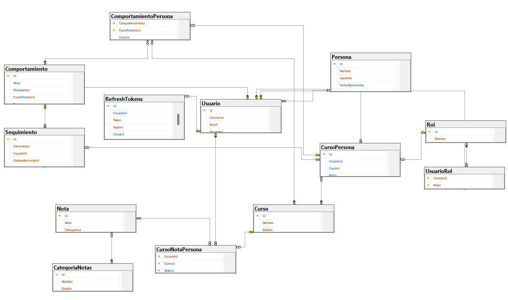
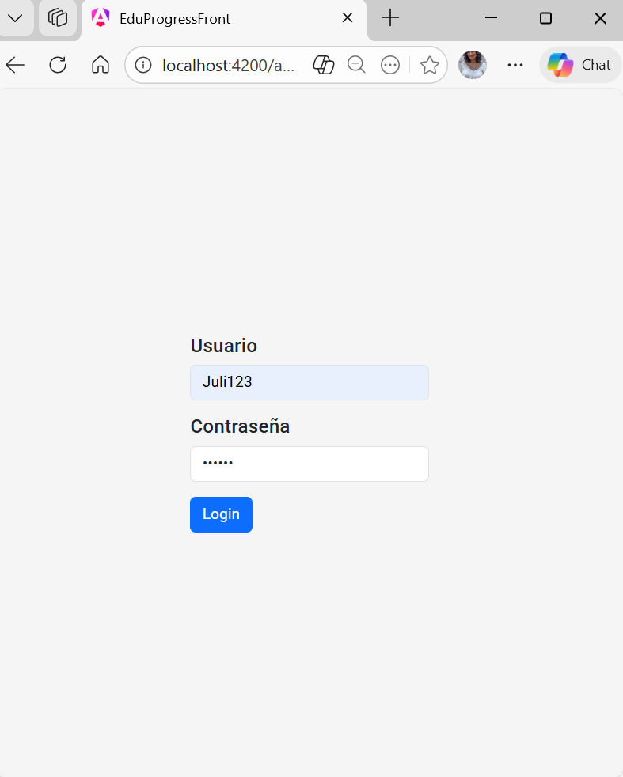
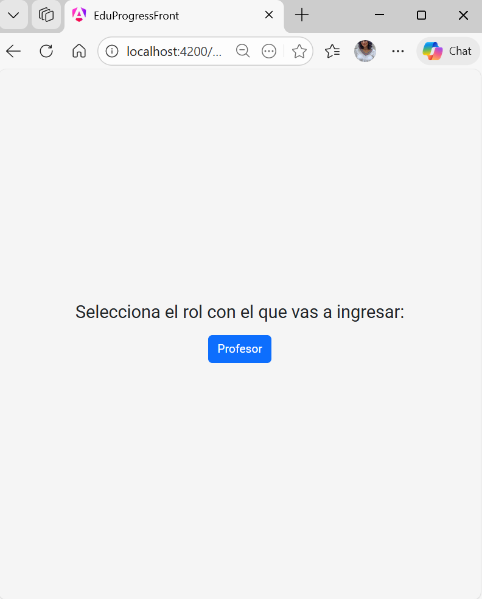
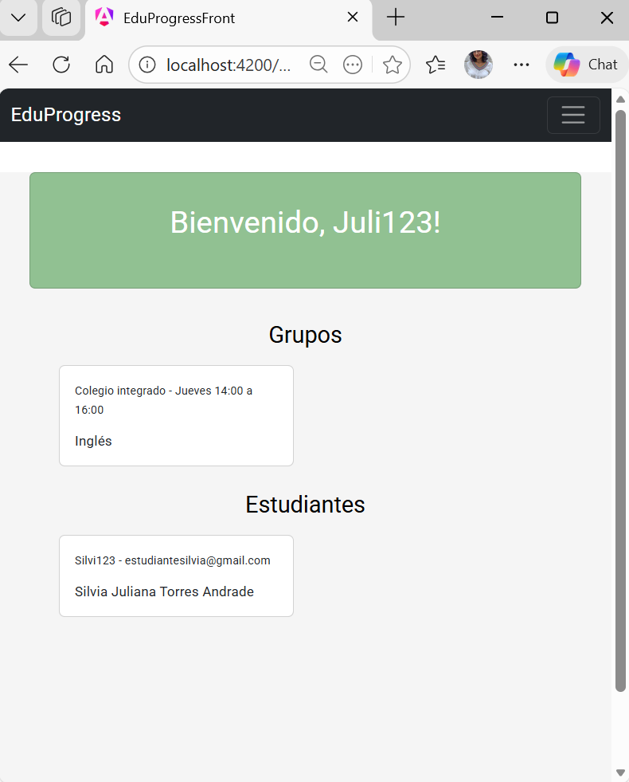
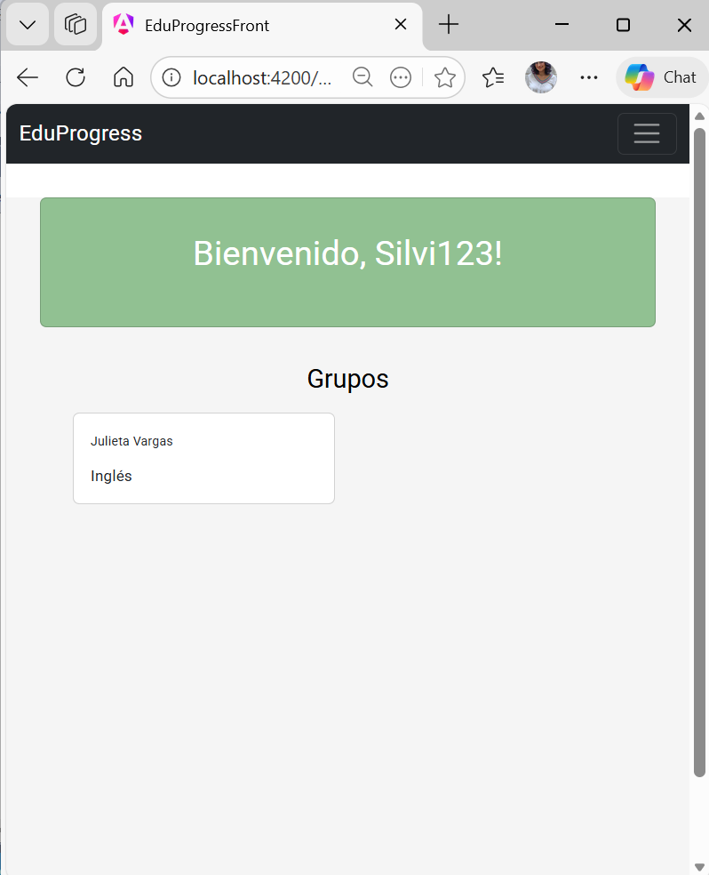
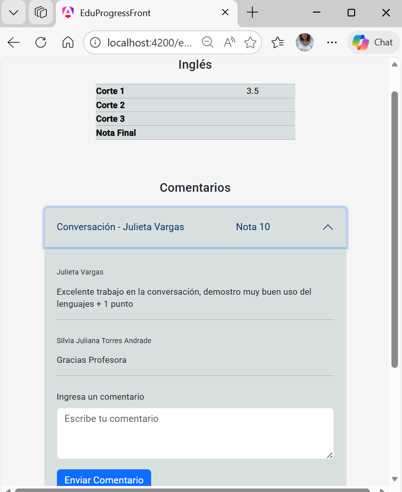

# EduProgress

### Academic Progress Tracking Platform  
**Technical Repository Documentation**

| Backend | Frontend | Status |
|--------|----------|--------|
| .NET 8 / C# | Angular 17 | In Development |


---

## 1. Project Description

**EduProgress (MEP — MyEduProgress)** is a digital platform designed to improve the tracking of students' academic progress. It enables teachers to register grades, behavioral observations, and follow up on students continuously per course, supporting data-driven and personalized education.

### Problem Statement

In modern and diverse educational environments, teachers often lack integrated tools to:

- Record and review grade history by academic evaluation periods.
- Document individual student behavior and participation.
- Centralize follow-up and monitoring information across teachers.

### Project Objective

To develop a robust RESTful API with an Angular frontend that allows teachers to track learning processes in detail, identify improvement opportunities, and personalize instruction based on structured academic data.

---

## 2. Current Project Status

The project reached a partially functional state. Due to time constraints, not all originally planned modules were completed.

| Module | Status |
|-------|--------|
| JWT Authentication + Refresh Token | ✅ Completed (Backend) |
| Role-Based Access Control (RBAC) | ✅ Completed (Backend) |
| Course Management | ✅ Completed (Backend) |
| Grade Management by Evaluation Period | ✅ Completed (Backend) |
| Behavior Registration | ✅ Completed (Backend) |
| Follow-Up / Academic Comments | ✅ Completed |
| Student View (Frontend) | ✅ Completed |
| Teacher Dashboard | ⚠️ Partial |
| Data Analytics Module | ❌ Pending |
| External LMS Integration | ❌ Pending |
| Unit & Integration Testing | ❌ Pending  |

---

## 3. System Architecture

### 3.1 General Architecture

The project follows **Clean Architecture** principles on both backend and frontend, ensuring a clear separation of concerns and independent layers.

### Backend (.NET 8)
- **API Layer (Presentation)**: Controllers, DTOs, Filters, Middlewares
- **Application Layer (Business Logic)**: Interfaces, Repositories, Services
- **Domain Layer (Core Model)**: Entities, BaseEntity, Value Objects
- **Infrastructure Layer (Persistence)**: EF Core, Migrations, Seeding, SQL Server

### Frontend (Angular 17)
- **Standalone Components**: auth, home, role, students-view
- **Shared Components**: sidebar, info cards, common services
- **Core Layer**: Guards, interceptors
- **Models**: TypeScript interfaces

---

## 3.2 Backend Layer Breakdown (.NET 8)

### EduProgressApi — Presentation Layer

HTTP entry point of the application.

- **Controllers**:
  - BaseApiController
  - UsuarioController
  - CursoController
  - NotasController
  - ComportamientoController
  - RolController
  - SeguimientoController
  - UsuarioRolController
  - PersonaController

- **Services**:
  - UserService (registration, login, JWT & refresh token lifecycle)

- **Extensions**:
  - ApplicationServiceExtension (DI, CORS, JWT, AutoMapper)

- **Helpers**:
  - JWT.cs
  - Autorizacion.cs
  - Pager.cs
  - Params.cs

### Application — Business Logic Layer

Contains business contracts and implementations.

- **Interfaces**:
  - IGeneric<T>, IUsuario, IRol, ICurso, INotas, IComportamiento,
    ISeguimiento, IPersona, IUsuarioRol

- **Repositories**:
  - EF Core–based implementations

- **DTOs**:
  - RegisterDto, LoginDto, CursoDto, UsuarioDto, etc.

### Domain — Domain Layer

Pure domain model without external dependencies.

- **BaseEntity**: Common Id
- **Entities**:
  - Usuario, Persona, Rol, UsuarioRol
  - Curso, CursoPersona
  - Nota, CategoriaNotas, CursoNotaPersona
  - Comportamiento, ComportamientoPersona
  - Seguimiento, RefreshToken

### Infrastructure — Infrastructure Layer

Handles persistence and database configuration using Entity Framework Core with SQL Server.

- EduProgressContext (DbContext)
- Fluent API entity configurations
- EF Core Migrations
- Declarative Seeding
  - Roles: Administrator, Teacher, Student, Person
  - Grade Categories: Term 1, Term 2, Term 3, Final Grade

---

## 3.3 Frontend Architecture (Angular 17)

Single Page Application with Server-Side Rendering (SSR), standalone components, lazy loading, Angular Material, and Bootstrap 5.

### Routes

| Route | Description |
|------|-------------|
| /auth | Login (public) |
| /home | Main dashboard (protected) |
| /rol | Role Selecction (protected) |
| /estudiante | Student grades and academic comments |
| ** | Redirect to /auth |

---

## 4. Design Patterns & Best Practices

### 4.1 Repository Pattern

All data access logic is encapsulated in repositories implementing generic and specific interfaces.

- IGeneric<T>: CRUD + pagination
- GenericRepository<T>: Base EF Core implementation
- Domain extensions: ICurso, INotas, IComportamiento, etc.

### 4.2 Dependency Injection

All dependencies are registered via extension methods, keeping Program.cs minimal.

```csharp
services.AddScoped<IUsuario, UsuarioRepository>();
services.AddScoped<IUserService, UserService>();
services.AddScoped<IPasswordHasher<Usuario>, PasswordHasher<Usuario>>();
```

### 4.3 AutoMapper

Clear separation between domain entities and DTOs.

```csharp
CreateMap<Rol, RolDto>().ReverseMap();
CreateMap<Usuario, UsuarioDto>().ReverseMap();
CreateMap<Curso, CursoDto>().ReverseMap();
```

### 4.4 JWT + Refresh Token Authentication

- Short-lived Access Tokens (JWT HS256)
- Refresh Tokens stored in HttpOnly cookies
- Token rotation and revocation supported


### 4.5 Code First Approach (Entity Framework Core)

This project follows a **Code First** approach using **Entity Framework Core**, where the database schema is generated and maintained directly from the C# domain model.

All entities are defined in the Domain layer, relationships and constraints are configured using the Fluent API, and schema changes are managed through EF Core migrations. The database can be created and evolved automatically without relying on a pre-existing schema.

This approach ensures strong alignment between the domain model and the database, improves maintainability, and supports safe schema evolution over time


### 4.6 Fluent API Configuration

All database mappings are defined using IEntityTypeConfiguration<T> classes.

```csharp
modelBuilder.ApplyConfigurationsFromAssembly(Assembly.GetExecutingAssembly());
```

### 4.7 Generic Pagination

Reusable pagination method within repositories.

```csharp
Task<(int totalRecords, IEnumerable<T> records)> GetAllAsync(int pageIndex, int pageSize, string search);
```

### 4.8 Declarative Seeding

Roles and grade categories are seeded automatically at migration time.

### 4.9 Angular Standalone Components & Lazy Loading

Route-level lazy loading reduces initial bundle size. sessionGuard protects private routes.

---

## 5. Technology Stack

### Backend
- .NET 8 / C#
- ASP.NET Core
- Entity Framework Core
- SQL Server
- AutoMapper
- JWT Bearer Authentication
- BCrypt / PasswordHasher
- Swagger / OpenAPI

### Frontend
- Angular 17 (SSR)
- Angular Material
- Bootstrap 5
- RxJS
- TypeScript 5.4

---

## 6. Folder Structure

### Backend

```
Back/
├── EduProgress.sln
├── EduProgressApi/
│   ├── Controllers/
│   ├── Extensions/
│   ├── Helpers/
│   ├── Profiles/
│   ├── Services/
│   └── Program.cs
├── Application/
│   ├── Interfaces/
│   ├── Repositories/
│   └── Dtos/
├── Domain/
│   └── Entities/
└── Infrastructure/
    ├── Data/Configuration/
    ├── Data/Migrations/
    ├── Seeding/
    └── EduProgressContext.cs
```

### Frontend

```
Front/EduProgressFront/src/app/
├── components/
│   ├── auth/
│   ├── home/
│   ├── rol/
│   └── students-view/
├── shared/
│   ├── info-cards/
│   ├── side-bar/
│   └── services/
├── core/guards/
├── models/
├── app.routes.ts
└── app.config.ts
```

---

## 7. Data Model Overview

| Entity | Description |
|-------|-------------|
| Usuario | Authentication account |
| Persona | Personal user data |
| Rol  | Administrator, Teacher, Student, Person |
| UsuarioRol  | N:M User–Role relationship |
| Curso  | Academic course |
| CursoPersona | Course enrollment |
| CategoriaNotas | Evaluation periods |
| Nota | Individual grade |
| CursoNotaPersona | Grade per user/course/category |
| Comportamiento | Behavior category |
| ComportamientoPersona | Student behavior log |
| Seguimiento | Academic follow-up comment |
| RefreshToken | Session renewal token |


## Database Diagram

The following diagram shows the main entities and relationships used in the EduProgress database:


``
---

## 8. Configuration & Execution

### Prerequisites
- .NET 8 SDK
- Node.js 18+
- Angular CLI 17
- SQL Server

## 🔧 Setup & Database Initialization

 - Configure connection string in `appsettings.json`
 - Configure JWT parameters

### Recommended Database Setup (Code First)

This project uses a **Code First** approach with Entity Framework Core.  
To ensure the database is created correctly and aligned with the current domain model, it is **recommended to recreate the initial migration from scratch** when setting up the project locally.

---

### Steps

#### 1. Remove existing migrations

Delete the following folder:

```
Infrastructure/Data/Migrations
```

This guarantees a clean schema generation based on the current entities and Fluent API configuration.

---

#### 2. Create a new initial migration

Run the following command from the backend root directory:

```bash
dotnet ef migrations add InitialCreate   --project ./Infrastructure/   --startup-project ./EduProgressApi/   --output-dir ./Data/Migrations
```

This command generates a fresh initial migration derived from the domain model.

---

#### 3. Update the database

Apply the migration to the database using:

```bash
dotnet ef database update   --project ./Infrastructure/   --startup-project ./EduProgressApi/
```

This ensures the database schema is created and updated correctly.

---

### Additional Notes

- Since some frontend modules are not yet implemented, **courses and users must be created from the backend** (via API endpoints or database seeding) in order to properly test and review the system functionalities.
- Roles and reference data are automatically inserted via declarative seeding.

✅ Following this process guarantees database consistency and avoids issues caused by outdated or mismatched migrations.

---

### Frontend Setup

```bash
cd Front/EduProgressFront
npm install
ng serve
```

> API base URL is currently configured in `auth.service.ts` (pending move to environment.ts).

---


## 📸 9. Application Preview

### 🔐 Login


### 🕹️ Role Selection


### 🏠 Dashboard

#### Teacher Dashboard


#### Student Dashboard


### 💬 Comments and notes view


## 10.Next Steps

- Complete teacher dashboard
- Implement academic analytics with charts
- Externalize Angular environment configuration
- Enable rate limiting
- Enable API versioning
- Complete unit & integration testing
- Harden CORS policy for production
- Integrate external LMS platforms
